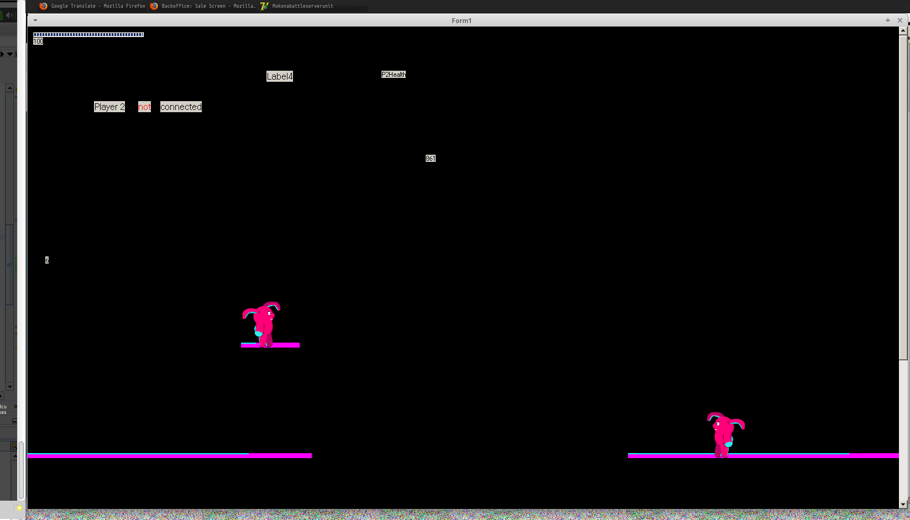

MyDelphiGame
============

Wrote it last summer, when Sergey Ilyich taught us how to OOP

To play, player1 have to run "MokonaBattleServerUnit.exe" from root directory;
Then player2 have to run "MokonaClient.exe" form "Client" directory and enter IP of player1. Then both players can manipulate their character (it may be seen on player1's screen only, though).

Control:
Left/Right - moving
Up - jump
Space - resurrection

